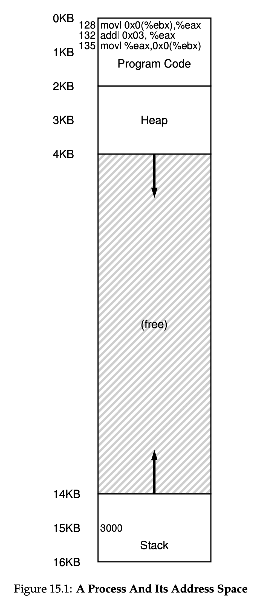
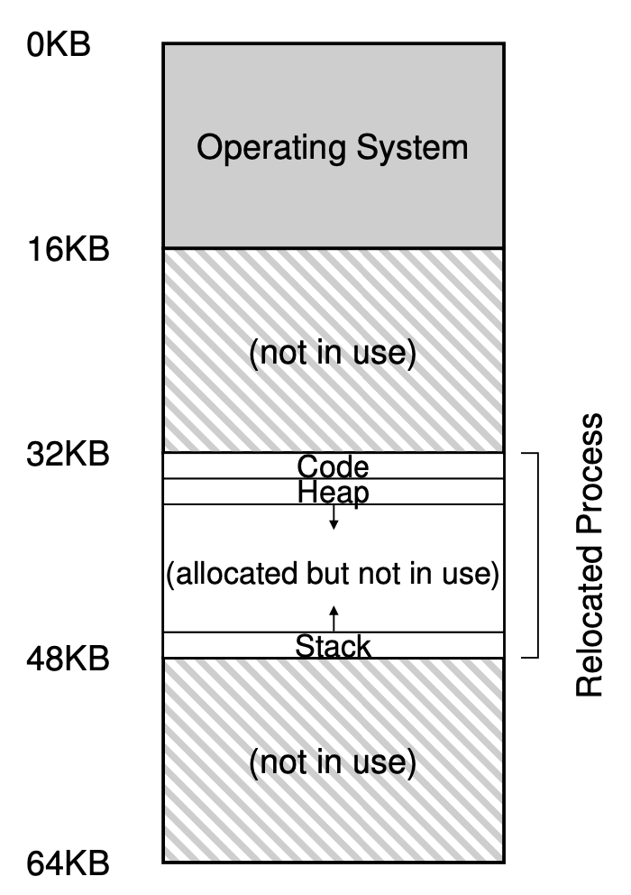

# Chapter 15

## Memory Virtualization

- We attain both efficiency and control over the hardward while providing the desired virtualization
- Efficiency means we make use of hardware support
- Control means all applications are only allowed to access their own memory
- The generic approach we use is called **hardware-based address translation**, or simply **address translation**
- With address translation, the hardware transforms each virtual memory address to a physical address
- The OS must get involved and manage memory such as keeping track of free locations and judiciously intervening to maintain control over how memory is accessed

## Assumptions

- User's address space must be placed contigously
- The size of address space is not too big and less than the size of physical memory
- Each address space is exactly the same size

## An example

- Instructions

```asm
128: movl 0x0(%ebx), %eax
132: addl $0x03, %eax
135: movl %eax, 0x0(%ebx)
```

- Virtual Memory (Process Point of View)

<!--  -->

</img>

- Physical Memory (OS Point of View)

</img>

## Dynamic Relocation (Hardware-based)

- It is also called **base and bounds**
- We will need **two** registers from CPU, **base & bounds (limit)**
- Each program is written and compiled as if it is loaded at address **zero**
- However, the OS decides where in the physical memory a process is located and sets the base register to that value
- Then, the virtual address in the process will be offset (translated) by the base in the CPU
- **physical address = virtual address + base**
- If a process generates an address greater than the **bound**, then the CPU will raise an exception to protect the memory

### Example

- Let's take a look at the example above
- The program counter in the process will first be initialized to 128
- The process fetches 128 as the virtual address, and the hardware will then translate that to 32KB (32768) + 128 which is 32896
- The hardware then fetchs and executes the instruction at 32896

## Operating System Responsibilites

1. The OS must take action when a process is created
   1. find space for its address space in a data structure (often called free list)
   2. allocate space for it
   3. mark it as used in the data structure
2. The OS must do some cleanup when a process is terminated
   1. reclaiming alll of its memory
   2. mark the address space as not used in the data structure
3. The OS must perform some additional steps during a context switch
   1. save and restore the base and bound register pair on each CPU in PCB
4. The OS sometimes have to move an address space to a new location
   1. deschedule the process
   2. copy the address space to the new location
   3. update the base register in the PCB
5. The OS must provide exception handlers to handle exceptions like out-of-bound

## Timeline of A Process to Try to Executue A Violation

| OS (kernel)                        | Hardware                  | Program (user)      |
| ---------------------------------- | ------------------------- | ------------------- |
| Start Process A                    |                           |                     |
| Allocate an entry in process table |                           |                     |
| Allocate memory for the process    |                           |                     |
| Set base/bound registers           |                           |                     |
| return-from-trap                   |                           |                     |
|                                    | restore registers of A    |                     |
|                                    | move to user mode         |                     |
|                                    | jump to A's PC            |                     |
|                                    |                           | Process A runs      |
|                                    |                           | Fetch instruction   |
|                                    | translate virtual address |                     |
|                                    | perform fetch             |                     |
|                                    |                           | Execute Instruction |
|                                    | If explicit load/store:   |                     |
|                                    | ensure address is legal   |                     |
|                                    | translate virtual address |                     |
|                                    | perform load/store        |                     |
|                                    |                           | ...                 |
|                                    | Timer Interrupt           |                     |
|                                    | move to kernel mode       |                     |
|                                    | jump to handler           |                     |
| Handle time                        |                           |                     |
| decide: stop A, run B              |                           |                     |
| call `switch()` routine            |                           |                     |
| save regs(A) to PCB(A)             |                           |                     |
| (including base/bounds)            |                           |                     |
| restore regs(B) from PCB(B)        |                           |                     |
| (including base/bounds)            |                           |                     |
| return-from-trap                   |                           |                     |
|                                    | restore registers of B    |                     |
|                                    | move to user mode         |                     |
|                                    | jump to B's PC            |                     |
|                                    |                           | Process B runs      |
|                                    |                           | Execute bad load    |
|                                    | Load is out-of-bounds     |                     |
|                                    | move to kernel mode       |                     |
|                                    | jump to trap handler      |                     |
| Handle the trap                    |                           |                     |
| decide to kill process B           |                           |                     |
| deallocate B's memory              |                           |                     |
| free B's entry in process table    |                           |                     |

## Keywords

1. Memory Management Unit (MMU): the part of the processor that helps with address translation
