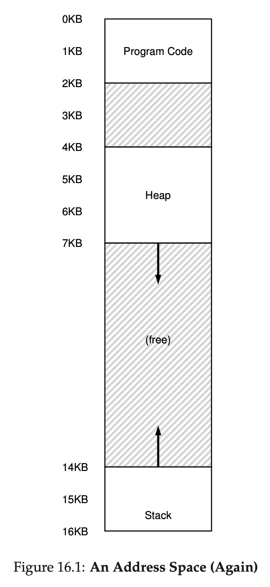

# Chapter 16

## Segmentation

- If we allocate memory at the process level, then we will allocate a lot of memory for nothing.
- For example, the memory between static data and heap, heap and stack, etc.
- Therefore, it is more reasonable to store base and bounds for a **segmentation**, a logical piece of address space with continuous usage, i.e. no empty space

### Segment Registers Example

| Segment | Base | Size |
| ------- | ---- | ---- |
| Code    | 32K  | 2K   |
| Heap    | 34K  | 3K   |
| Stack   | 28K  | 2K   |

</img>

- We want to read virtual address 4200
- First, we calculate the offset by subtract 4200 by 4KB since heap starts at 4KB at virtual address space
- Then, we use the offset of 104, and get the physical memory address by adding 104 to 34K, which is 34920

## Which Segment Problem

- We need some ways to determine which segment an address is referring to
- Explicit approach: use the top bits for chopping up the address space
  - For example, if we have four segments, we use the top 2 bits to refer to different segments
- Inplicit approach: the hardware determines the address by looking at how the address is formed
  - program counter: code segment
  - stack pointer: stack segment
  - anything else: heap segment

## Grow Different Directions Problem

- The stack grows backward unlike other segments
- Therefore, we need to store this information about the direction that a segment grows

  | Segment | Base | Size | Grows Positively? |
  | ------- | ---- | ---- | ----------------- |
  | Code    | 32K  | 2K   | 1                 |
  | Heap    | 34K  | 3K   | 1                 |
  | Stack   | 28K  | 2K   | 0                 |

- For example, in this example,
  - we want to access virtual address 15KB, which is 0x3C00
  - the hardware uses the top two bits to determine which segment this is, the stack
  - which leaves us an offset of 3KB, 0xC00
  - the hardware looks at the direciton and sees it grows negatively
  - Therefore, it subtracts 3KB by 4KB, the maximum size of the segment, leading to the true offset: -1KB
  - Finally, we add this offset to the base address of the stack, 28KB, and get 27KB as the final answer

## Sharing Support

- Sometimes, we can share segments among processes like the static data segment and code segment
- We use a few bits to indicate whether a program can read/write the segment or execute what's in the segment
- With the protection bits, a hardware would also need to check if an action is permissible in addition to the bound

## Possible Issues

1. What should an OS do during a context switch
   1. save segment registers for old process
   2. restore segment registers for new process
2. OS interaction when segments grow
   1. update the segment size by modifying the bound value
   2. or reject the request of adding more space for the segment
3. OS management over free space
   1. when a new process is created, the OS needs to find the free space to allocate

## Solutions to External Fragmentation

1. We can **compact the address space**, which is to to rearrange the existing segments
2. We can use a **free list management algorithm** that tries to keep large extents of memory available for allocation
3. **best fit**: finds the free space closest to the requested size
4. **worst fit**, **first fit**, **buddy algorithm**, etc.

## Keywords

1. coarse-grained: chops the address space into just a few segments
2. fine-grained: chops the address space into a large number of segments to provide more flexibility
3. external fragmentation: physical memory full of free little unused holes
