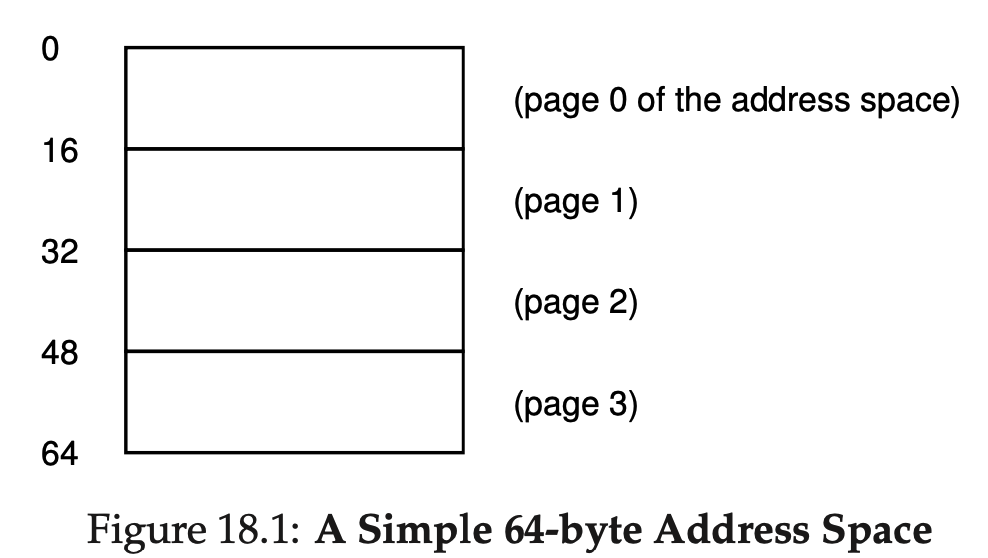
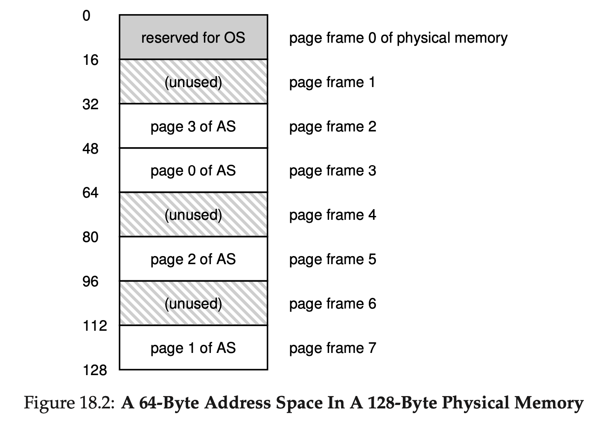
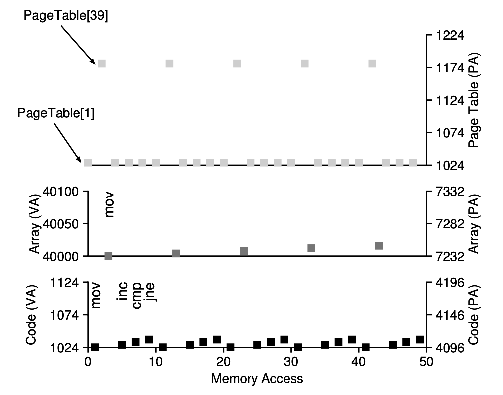

# Chapter 18

## Paging

- In the variable-sized approach, the segmentation, the address space could be fragmented, which could be challenging
- Thus, we consider another approach, chopping the address space into a fixed-sized pieces, which is called **pages**
- Corresphondly, the physical memory as an array of pages can be called **page frames**

### Translation

- To translate this virtual address that the process generated, we have to use two components:
  1.  virtual page number (VPN)
  2.  offset (within the page)
- We use the VPN to decide which page to read from
- We use the offset to decide which byte to read in the page
- Then, the OS will translate the VPN to PPN to find the physical page

### Example

- We have a 128-Byte physical memory and a 64-byte address space and we want to read 21, i.e. 0x010101
- Because the address space is 64 bytes, we need 6 bits for our virtual address.
- We use the first 2 bits as VPN and last 4 as the offset
- This means the VPN is 3 and the offset is 5

</img>
</img>

## Issue #1: Page Table Size

- Consider a typical 32-bit address space, with 4KB, $2^{12}$ bits, pages
- We will than have $2^{20}$ pages, and if a PTE is 4 byte, we will need a page table with the size of 4MB for **each** process

### Approach #1: Valid Bit

- A valid bit is an indication if a translation of a page is valid
- For the invalid virtual pages, we simply don't allocate a physical page to it to save space
- For example,
  - in a process, we mark all unused space between heap and stack
  - if the process wants to access that part, it generate a trap to OS and the OS will terminate the prcess

### Different Bits

1. Protection Bit: indicating if a page can be read from, writen to, or executed from
2. Present Bit: indicating if a page is in physical memory or not (it has been swapped out)
3. Dirty Bit: indicating if a page has been modified since it was brought into memory
4. Reference Bit: used to track if a page has been accessed in memory (to help the OS decide if this page should be swapped or not)

## Issue #2: Page Table Slow

- Accessing Memory With Paging

```
// Extract the VPN from the virtual address
VPN = (VirtualAddress & VPN_MASK) >> SHIFT

// Form the address of the page-table entry (PTE)
PTEAddr = PTBR + (VPN * sizeof(PTE))

// Fetch the PTE
PTE = AccessMemory(PTEAddr)

// Check if process can access the page
if (PTE.Valid == False)
    RaiseException(SEGMENTATION_FAULT)
else if (CanAccess(PTE.ProtectBits) == False)
    RaiseException(PROTECTION_FAULT)
else
    // Access is OK: form physical address and fetch it
	offset = VirtualAddress & OFFSET_MASK
	PhysAddr = (PTE.PFN << PFN_SHIFT) | offset
	Register = AccessMemory(PhysAddr)
```

## Memory Trace Example

### Code

- C Code

```c
int array[1000];

for (i = 0; i < 1000; i++)
	array[i] = 0;
```

- Assembly Code

```asm
1024 movl $0x0,(%edi,%eax,4)
1028 incl %eax
1032 cmpl $0x03e8,%eax
1036 jne  0x1024
```

### Information

- 64KB address space, 1KB page size, linear page table, page table locates at physical address 1KB
- Static Code Page at VPN of 1, PFN of 4
- Array itself at VPN of 39 to 42, PFN of 7 to 10

### Trace Diagram

- Each instruction has two references
  - Fetch physical address from virtual address via page table
  - Fetch the instruction from physical address
- For each `mov` instruction, there are additional two references
  - Fetch physical address of the array from virtual address via page table
  - Move the data to the physical address

</img>

## Keywords

1. Page Table: a _per-process_ data structure to store **address translations** for mapping virtual page number to physical page number
2. Virtual Page Number (VPN): the number of the virtual page
3. Physical Frame Number (PFN): the number of the physical page, also known as the physical page number (PPN)
4. Page Table Entry (PTE): an entry in the page table
5. Swap: swapping parts of the address space that are rarely used to the disk
