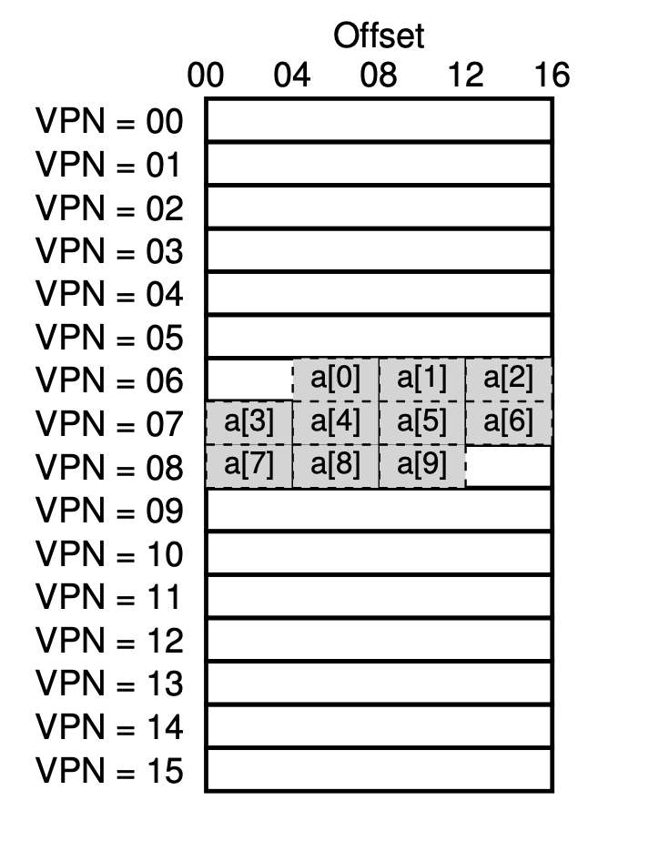

# Chapter 19

## Translation-Lookaside Buffer (TLB)

- paging requires a large amount of mapping information
- and memory lookup via paging could be costly
- thus, having a cache-like in chip's **memory management unit** could be really useful
- so TLB is also called address-translation cache

### TLB Content

- A TLB entry looks like this: `VPN | PFN | other bits`
- A typical type of TLB is **fully associative**

  - this means any given translation could be anywhere in the TLB
  - and the CPU will possibly have to search through the entire TLB in parrallel to find it

- In the **other bits**,

  - the common ones are valid, protection, dirty, etc. just like in the the page table
  - And code pages could be marked _read_ & _execute_

### TLB Basic Algorithm

1. extract VPN form the virtual address
2. look up the VPN in the TLB
3. if VPN is in TLB, (**TLB hit**)

   1. if it is not protected, read the physical address stored in the TLB
   2. otherwise, raise an exception (protection fault)

4. otherwise, (**TLB miss**)

   1. find and access PTE
   2. if PTE is invalid, raise an exception (segmentation fault)
   3. if PTE is protected, raise an exception (protection fault)
   4. otherwise, insert the VPN to the TLB
   5. and retry the algorithm

### Pseudo Code

```
VPN = (VirtualAddress & VPN_MASK) >> SHIFT

(Success, TlbEntry) = TLB_Lookup(VPN)

if (Success == True)   // TLB Hit

    if (CanAccess(TlbEntry.ProtectBits) == True)
        Offset   = VirtualAddress & OFFSET_MASK
        PhysAddr = (TlbEntry.PFN << SHIFT) | Offset
        Register = AccessMemory(PhysAddr)

    else
        RaiseException(PROTECTION_FAULT)
else                  // TLB Miss

    PTEAddr = PTBR + (VPN * sizeof(PTE))
    PTE = AccessMemory(PTEAddr)
    if (PTE.Valid == False)
        RaiseException(SEGMENTATION_FAULT)
    else if (CanAccess(PTE.ProtectBits) == False)
        RaiseException(PROTECTION_FAULT)
    else
        TLB_Insert(VPN, PTE.PFN, PTE.ProtectBits)
        RetryInstruction()
```

### Example: Accessing An Array

- We have an integer array of length 10
- The virtual memory allocation is as the following picture
- The array starts at VPN of 6 and offset of 4
- The C code looks like the following

```c
int sum = 0;
for (int i = 0; i < 10; i++) sum += a[i];
```

</img>

- For `a[0]`, we have a TLB miss because this is the first time the program accesses the array
- For `a[1]`, we have a TLB hit because it is in the same page as `a[0]` (same for `a[2]`)
- And for the rest of the array, we have _miss hit hit hit miss hit hit_

## Who Handles Misses?

- In the past, it was the hardware to handle all misses
  - it needs to know where the page tables
  - it will use something called **page table base register**
- In more modern architectures, the hardware raises an exception and traps to the OS
  - This is because **modifying the TLB is a privileged action**

### Pseudo Code for OS-managed TLB Algorithm

```
VPN = (VirtualAddress & VPN_MASK) >> SHIFT
(Success, TlbEntry) = TLB_Lookup(VPN)

if (Success == True)   // TLB Hit

    if (CanAccess(TlbEntry.ProtectBits) == True)
        Offset   = VirtualAddress & OFFSET_MASK
        PhysAddr = (TlbEntry.PFN << SHIFT) | Offset
        Register = AccessMemory(PhysAddr)

    else
        RaiseException(PROTECTION_FAULT)

else                  // TLB Miss
    RaiseException(TLB_MISS)
```

### Details for OS to Handle Misses

1. the `return-from-trap` will be different from the normal `return-from-trap`

   1. the noraml one will return back to the user code and start execute the next instruction in user program
   2. in handling this exception (TLB miss), we should return to the last instruction in the hardware, i.e. retry reading from the TLB
   3. This will then result in TLB hit because we add the physical address to the TLB in the OS

2. the OS needs to be extra careful not to cause an infinite chain of TLB misses

   1. there are many different solutions
   2. for example,

      - we could put the TLB miss handlers in physical handler
      - thus fetching the handler won't require any translation, and thus no possiblity for chain

   3. for another example,

      - we could reserve some entries in the TLB for permanently-valid translations
      - thus fetching the handler will never be a miss

## Issue #1: Context switches

- TLB should contain translation only valid for the current running process
- thus, the hardware and/or the OS must ensure each process only uses translation for itself

| VPN | PFN | valid | prot |
| --- | --- | ----- | ---- |
| 10  | 101 | 1     | rwx  |
| --  | --  | 0     | --   |
| 10  | 170 | 1     | rwx  |
| --  | --  | 0     | --   |

### Approach #1: flush

- set all valid bits to 0
- on a software-based system, use an privileged hardware instruction
- on a hardware-based system, the flush would be automatically executed whenever the **page-table register** is changed
- Disadvantage: each time a process starts running, it will always miss the first translation of every address

| VPN | PFN | valid | prot |
| --- | --- | ----- | ---- |
| 10  | 101 | 0     | rwx  |
| --  | --  | 0     | --   |
| 10  | 170 | 0     | rwx  |
| --  | --  | 0     | --   |

### Approach #2: Address Space Identifier (ASID)

- Some systems provide **address space identifier** to differentiate the running process
- But because the hardware needs to know which process is running,
- the OS needs to set some privileged regiers to the ASID of the current process

| VPN | PFN | valid | prot | ASID |
| --- | --- | ----- | ---- | ---- |
| 10  | 101 | 1     | rwx  | 1    |
| --  | --  | 0     | --   | --   |
| 10  | 170 | 1     | rwx  | 2    |
| --  | --  | 0     | --   | --   |

| Register 1 |
| ---------- |
| 1          |

### Sharing Pages

- Sometimes, we want to direct mutliple virtual pages in two mutliple processes to the same physical page in TLB
- We can do this like the following

| VPN | PFN | valid | prot | ASID |
| --- | --- | ----- | ---- | ---- |
| 10  | 101 | 1     | r-x  | 1    |
| --  | --  | 0     | --   | --   |
| 50  | 101 | 1     | r-x  | 2    |
| --  | --  | 0     | --   | --   |

## Issue #2: Replace Policy

- When the TLB is full, and a new entry comes in, which entry should be replaced?
- One common one is **least-recent-used** (LRU)
- Another one is **random**

## TLB Bottleneck

- if the number of pages a program accesses in a short period of time exceeds the number of pages a TLB can store
- the program will generae a large number of TLB misses
- this is called **TLB converage**

## Keywords

1. temporal locality: the quick re-referencing of memory items in time
2. CISC: complex-instruction set computers (uses hardware-managed TLB)
3. RISC: reduced-instruction set computers (uses software-managed TLB)
