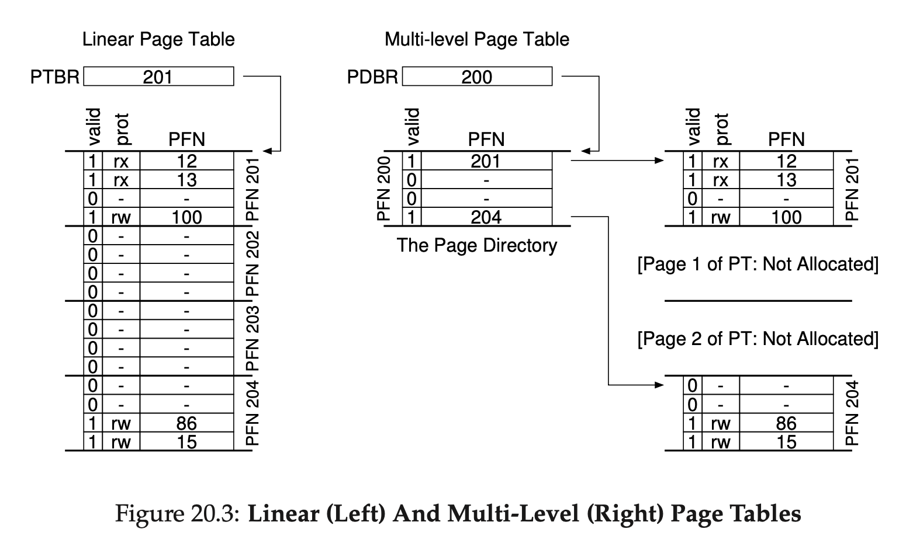

# Chapter 20

## Issues with Paging

- The biggest problem with paging is that the page table is too large
- In our previous implementations, we spend huge amount of memory to store the page entries, and most of them are marked as invalid

### Simple solution: Bigger Pages

- However, big pages lead to waste with each page
- Applications end up allocating pages but only using little bits, and memory quickly fills up with these overly-large pages
- This problem is known as **internal fragmentation**

### Approach #1: Paging Segments

- Instead of having a single page table for the entire address space of the process,
- we have one page table per logical segment
  - base register: the physic address of the page table of that segment
  - bound register: the end of the page table
- On context switch, the values of the regiters must be saved and restored to reflect for the running process

#### Upsides & Downsides

- Upsides
  1.  each bound register holds the value of the maximum valid page in a segment
  2.  unallocated pages between the heap and the stack no long take any space
  3.  (just to mark them as invalid)
- Downides
  1.  Segments are not as flexible because it assumes a certain usage pattern of the address space
  2.  if ew have a large but sparsely-used heap, we can still create a lot of page table waste
  3.  we could have external fragmentation again

#### Pseudo Code

```
SN = (VirutalAddress & SEG_MASK) >> SN_SHIFT
VPN = (VirutalAddress & VPN_MASK) >> VPN_SHIFT
AddressOfPTE = Base[SN] + (VPN * sizeof(PTE))
```

### Approach #2: Multi-level Page Tables

- We can chop the page table into something like tree
- First, divide the page table into page-sized units
- Then, if a page of the page table is invalid, don't allocate any page entries for that page of the page table at all
- This index structure to sub page table is called **page directory**
- Example

</img>

#### Upsides & Downsides

- Upsides
  1.  Reduce the waste of a great amount of unneccessary page table entry in linear table
  2.  Is generally compact and suuports sparse address space
  3.  Allows the sub page tables to be non contiguous in physical memory unlike the linear table
- Downsides
  1.  time-space trade off, the time to look up a virtual address is more costly
  2.  complexity

#### Pseudo Code

```
VPN = (VirtualAddress & VPN_MASK) >> SHIFT
(Success, TlbEntry) = TLB_Lookup(VPN)
if (Success == True)   // TLB Hit
  if (CanAccess(TlbEntry.ProtectBits) == True)
    Offset = VirtualAddress & OFFSET_MASK
    PhysAddr = (TlbEntry.PFN << SHIFT) | Offset
    Register = AccessMemory(PhysAddr)
  else
    RaiseException(PROTECTION_FAULT)
else // TLB Miss
  // first, get page directory entry
  PDIndex = (VPN & PD_MASK) >> PD_SHIFT
  PDEAddr = PDBR + (PDIndex * sizeof(PDE))
  PDE = AccessMemory(PDEAddr)
  if (PDE.Valid == False)
    RaiseException(SEGMENTATION_FAULT)
  else
    PTIndex = (VPN & PT_MASK) >> PT_SHIFT
    PTEAddr = (PDE.PFN << SHIFT) + (PTIndex * sizeof(PTE))
    PTE = AccessMemory(PTEAddr)
    if (PTE.Valid == False)
      RaiseException(SEGMENTATION_FAULT)
    else if (CanAccess(PTE.ProtectBits) == False)
      RaiseException(PROTECTION_FAULT)
    else
      TLB_Insert(VPN, PTE.PFN, PTE.ProtectBits)
      RetryInstruction()
```

## Inverted Page Tables

- instead of having many pages (one per process)
- we have one single page and the entry has all the information
- including which process is using the page which virtual page of that process maps to this physical page

## Swap

- We have assumed that page tables reside in physical memory
- it is still possible page tables are too big to fit in memory
- some systems have page tables in **kernel virtual memroy**
- and they **swap** page tables to disk back and forth based on the demand

## Keywords

1. Page Directory: tell you where the page of the page table is or the entrie page of the page table is invalid
2. Page Direct Entry: An entry in the page directory that usually have a **valid bit**
