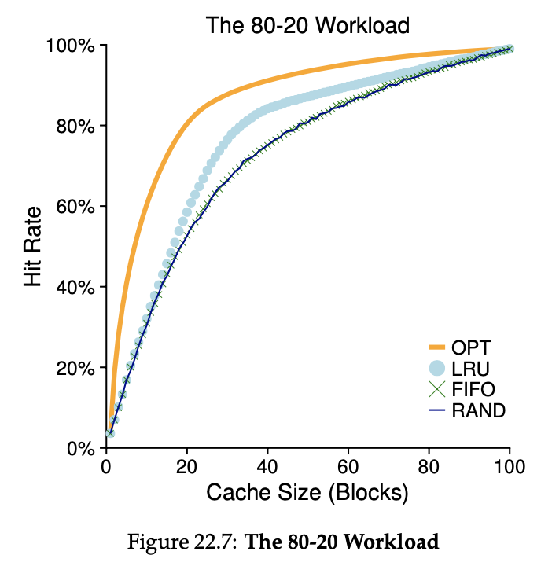

# Chapter 22

## Page Replacement

- It happens when little memory is free
- The OS has to start paging out pages to make room for new pages or actively-used pages

## Cache Management

- We can think of memory as the cache of all pages in the system
- our objective is to **minimize** the number of **cache misses**
- or **maximize** the number of **cache hits**
- With the number of cache hits and misses, we can calculate the **average memory access time** (AMAT)

### Average Memory Access Time (AMAT)

- A metric computer architects use for hardware caches
- Symbols
  - $T_M$: the cost of accessing memory
  - $T_D$: the cost of accessing disk
  - $P_{Miss}$ the probability of not finding the data in the cache
- In modern systems, $T_D$ is so high compared to $T_M$ that even a tiny miss rate will quickly dominate the overall AMAT
- For example,
  - say we have 10 references and miss 1 ($P_{Miss}$ of 0.1)
  - with a $T_D$ of 10*ms* and a $T_M$ of 100*ns*
  - the AMAT will be $100ns + 0.1 \times 10ms$
  - The result is 1.0001 $\mu s$, which is still way more than $100ns$

## The Optimal Replacement Policy

- The intuition is to replace the page that will be accessed furthest in the future
- But the future is generally **unknown**
- For example,
  - we have memory of 3 pages
  - we want to reference the pages as: 0, 1, 2, 0, 1, 3, 0, 3, 1, 2, 1
- The hit rate is $\frac{6}{6+5} = 54.5\%$
- The hit rate modulo compulsory misses is $\frac{6}{6+5-4} = 87.5\%$

| Access | Hit/Miss? | Evict              | Cache State |
| ------ | --------- | ------------------ | ----------- |
| 0      | Miss      |                    | 0           |
| 1      | Miss      |                    | 0, 1        |
| 2      | Miss      |                    | 0, 1, 2     |
| 0      | Hit       |                    | 0, 1, 2     |
| 1      | Hit       |                    | 0, 1, 2     |
| 3      | Miss      | 2                  | 0, 1, 3     |
| 0      | Hit       |                    | 0, 1, 3     |
| 3      | Hit       |                    | 0, 1, 3     |
| 1      | Hit       |                    | 0, 1, 3     |
| 2      | Miss      | 3 (anything not 1) | 0, 1, 2     |
| 1      | Hit       |                    | 0, 1, 2     |

## Policy #1: FIFO

- When a page enters the system, it is put on a queue
- And when a new page enters, and the memory runs out of space, then we pop off a page from the queue and swap it with the new page
- With the same example, we get the following result
- The hit rate is $\frac{4}{7+4} = 36.4\%$
- The hit rate modulo compulsory misses is $\frac{4}{7+4-4} = 57.1\%$

| Access | Hit/Miss? | Evict | Cache State |
| ------ | --------- | ----- | ----------- |
| 0      | Miss      |       | 0           |
| 1      | Miss      |       | 0, 1        |
| 2      | Miss      |       | 0, 1, 2     |
| 0      | Hit       |       | 0, 1, 2     |
| 1      | Hit       |       | 0, 1, 2     |
| 3      | Miss      | 0     | 1, 2, 3     |
| 0      | Miss      | 1     | 2, 3, 0     |
| 3      | Hit       |       | 2, 3, 0     |
| 1      | Miss      | 2     | 3, 0, 1     |
| 2      | Miss      | 3     | 0, 1, 2     |
| 1      | Hit       |       | 0, 1, 2     |

## Policy #2: Random

- When we need to swap out a page, we just randomly choose a page from the cache
- How the policy does completely depends on luck of the draw

## Policy #3: Least-Recently-Used (LRU)

- The policy to replace the least-recently-used page from the cache

| Access | Hit/Miss? | Evict | Cache State |
| ------ | --------- | ----- | ----------- |
| 0      | Miss      |       | 0           |
| 1      | Miss      |       | 0, 1        |
| 2      | Miss      |       | 0, 1, 2     |
| 0      | Hit       |       | 1, 2, 0     |
| 1      | Hit       |       | 2, 0, 1     |
| 3      | Miss      | 2     | 0, 1, 3     |
| 0      | Hit       |       | 1, 3, 0     |
| 3      | Hit       |       | 1, 0, 3     |
| 1      | Hit       |       | 0, 3, 1     |
| 2      | Miss      | 0     | 3, 1, 2     |
| 1      | Hit       |       | 3, 2, 1     |

## Algorithms Comparision with Different Workloads

1. no locality
2. 80-20
3. looping

</img>
</img>
</img>

## Approximating LRU: Clock Algorithm

- In LRU, we will often need to loop over the entire list of pages for the absolute LRU page is expensive
- The idea needs new hardware support: a reference bit (use bit) to note if the page is accessed or not
- For example, in **clock algorithm**,
  - we start from an arbritrary page
  - check if the page has the use bit of 0
  - if so, replace it
  - if not, set it to 0 and go check the next one
  - continue until we find the first page to replace

## Approximating LRU: Enhanced Clock Algorithm

- In clock algorithm, we will swap out the page in the memory when we find the victim
- However, we don't need to swap out a **clean** page because we can just use the original page in the disk when we need to swap it in again
- We only need to write back to the disk the **dirty** page that is modified in the memory
- The idea needs new hardware support: a dirty bit (use bit) to note if the page is modified or not
- So in the algorithm,
  - find the unused and clean page
  - if cant, then we find the unused and dirty
  - if cant, then we find the most recently used and clean
  - if cant, then we find the most recently used and dirty

## Other Policies

### Page Selection Policy

- The OS has to decide _when_ to bring a page into memory
- Some sample policies are **demand paging** or **prefetching**

### Page Write Policy

- The OS has to determine how to write pages out to disk
- One sample policies is **clustering**, i.e. grouping multiple to writes to a single big write I/O request to the disk

## Thrashing

- What should the OS do if the memory demands of a set of running processes exceeds the available physical memory?
- This situation is called **thrashing**
- One solution is to not run a subset of processes to control actively-used pages
- Another solution is to run a daemon process, which chooses a memory-intensive process to kill when memory is oversubscribed
  - But there could be a problem for this solution where other processes depend on the killed process

## Keywords

1. The hit rate modulo compulsory misses: _ignore_ the _first_ miss to a given page (because the first reference is always a miss regardless the policy)
2. Princple of locality: an observation about the programs and their local behavior
3. Demand Paging: the OS brings the page into memory when it is accessed
4. Prefetching: the OS guesses the page to be brought into
5. Thrashing: demand of a set of processes exceeds the available physical memory
