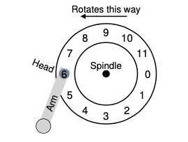
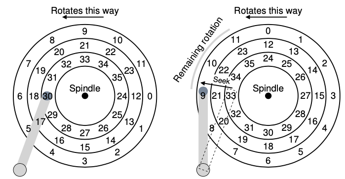
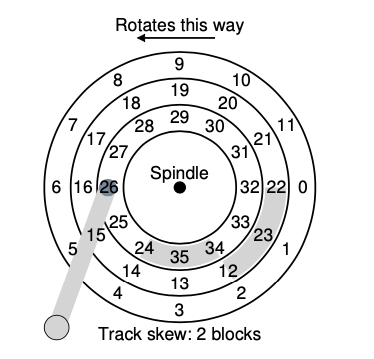
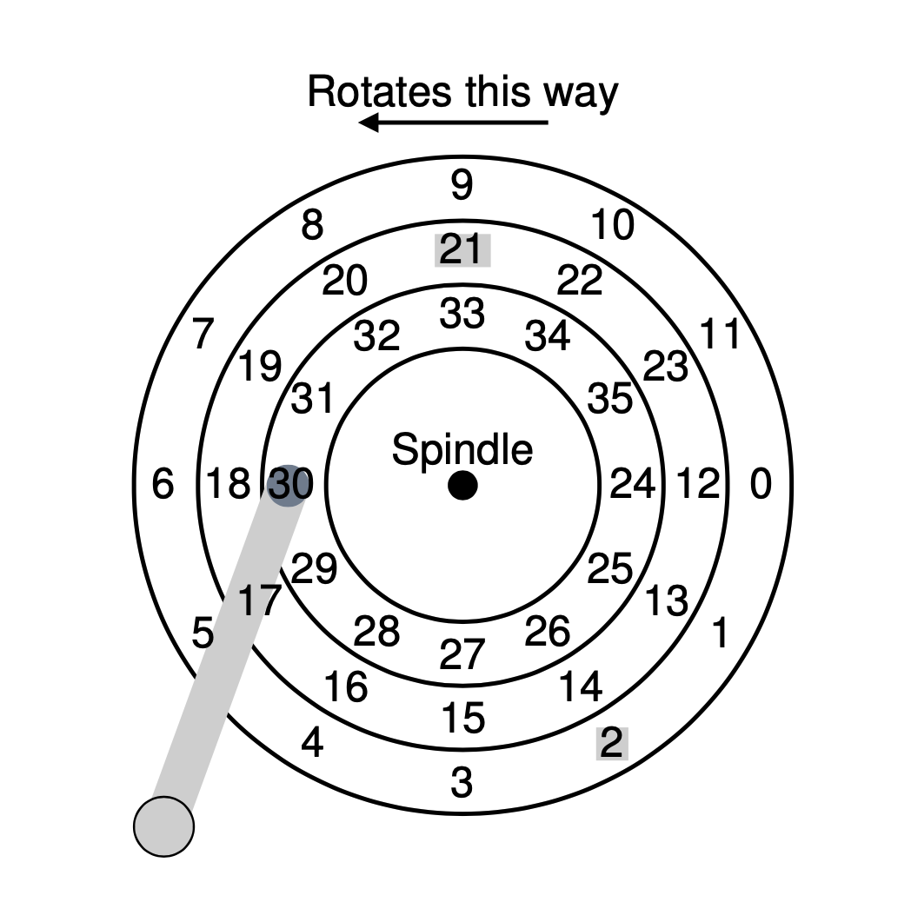

# Chapter 37

## Disks

- A disk drive consists of a large number of sectors, each of which can be read or written
- Multi-sector operations are possible, e.g. many file systems can read and write 4KB at the same time
- However, only a single sector write is atomic

## Assumptions

1. Accessing two blocks close to each other is faster than accessing two blocks far apart
2. Accessing contiguous chunk is the fastest access mode

## Example #1: Single-Track with A Head

- latency: in this example, the only latency is to **wait for the desired sector to rotate under the disk head**
- the latency is usually called **rotational delay**

</img>

## Example #2: Multiple Tracks

- Besides rotational delay, in multi-track disk, we also have another latency, seek time
- Seek time is to **wait for the disk arm to move to the correct track**
- There are four phases, _acceleration_, _coasting_, _deceleration_, _settling_
  - The settling time is usually quite significant
- After seek is done, the final phase of an I/O requests is to **transfer** (either read from or written to the surface)

</img>

## Other Details

### Track Skew

- When switching from one track, to another, the disk needs time to reposition the head
- Therefore, it makes sense to skew the tracks to support faster sequential transfer like the following

</img>

### Multi-Zoned Disk Drives

- Outer tracks tend to have more space than inner tracks, so it makes sense to have different number of sectors
- Therefore, we create multi-zoned disk drives, where a zone is a set of tracks on a surface with the same number of sectors

### Cache

- On reads, for example, if a request asks for a sector, we might want to read **the whole track** and store them in the cache
- On writes, we report
  1. once data has been put in the cache (write back, immediate reporting)
  2. after the write has been written to the disk (write through)

## Math Time

- Important formulas
  1.  $T_{I/O} = T_{seek} + T_{rotation} + T_{transfer}$
  2.  $R_{I/O} = \frac{Size_{Transfer}}{T_{I/O}}$
- Two of the most common ways to benchmark the disks
  1.  random workload (request with small and random workloads)
  2.  sequential workload (request with large and sequential workloads)

## Disk Scheduling

- Given a set of I/O requests, the scheduler examins the requests and decides which to schedule next
- Unlike general job scheduling, we can usually make good guess of how long a job is in disk scheduling
- The following approaches will be referring to this diagram

</img>

### Approach #1: Shortest Seek Time First (SSTF)

- SSTF order the queue of requests by track, prioritizing those in the closer track to the head
- For example, given the requests for sector 21 and 2, we will issue the request to 21 first
- Disadvantages:
  1.  drive geometry unavailable
      - The OS only sees the reqeusts at the **track** level instead of the sector level
  2.  starvation
      - if a steady stream of requests are to the same track as the head,
      - requests to other tracts might be completely ignored

### Approach #2: Elevator (SCAN)

- The main idea is to simply move back and forth across the disk servicing reqeusts in order across tracks
- If a request comes for a sector on tracks that are already been serviced on this sweep
- It won't be handled immediately, but until next sweep
- Different variants
  1.  F-SCAN (freeze): freezez the queue when it is doing a sweep
  2.  C-SCAN (circular): only sweep one direction
- Disadvantages:
  - It doesn't not take **rotation** into account

## Issues

1. Where is disk scheduling performed?
   - In older systems, the OS did everything
   - In modern systesm, disks can perform some complicated scheduling tasks
2. I/O Merging
   - Find opportunities to merge multiple small requests to a single large request
3. How long should the system wait before issue an I/O request to disk

## Keywords

1. platter: a circular hard surface where data is stored persistently
2. surface: each side of the platter is called a surface
3. spindle: the part connect to a motor to spin the platter around
4. track: a concentric set of sectors on a surface
5. disk head: the part to process reading and writing
6. disk arm: the part that moves around the surface to position the head over the desired track
7. sweep: a single pass across the disk in SCAN
