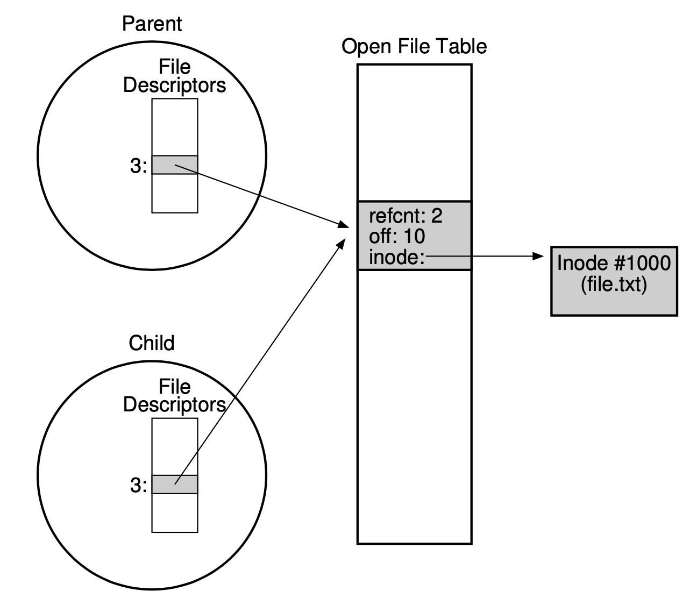

# Chapter 38

## File & Directory

- File
  - An array of bytes
  - Has a **low-level name**, or **inode number**
  - Usually ends with .(type) but this is not enforced
- Directory
  - A list of pairs as (user-readable name, low-level name)
  - Has a **low-level name**, or **inode number**

## Directory Hierarchy (UNIX)

- The directory hierarchy starts at root directory (/)
- It uses a separator to name subsequent sub-directories

## File Descriptor in A Process

- A process will have a list of open files and file descriptors are the index to a file
- The first three ones are usually reserved for `stdin`, `stdout`, `stderr`

## File System Interface

### Create

- The first argument is the filename of the new file (in the current working directory)
- The second argument is a number of different flags
  - `O_CREAT`: create the file if it doesn't exist
  - `O_WRONLY`: ensure the file can only be written
  - `O_TRUNC`: truncates the file's content if it exists
- The third argument is the permission
  - `S_IRUSR`: readable
  - `S_IWUSR`: writeable
- Code

```c
int fd = open("foo", O_CREAT|O_WRONLY|O_TRUNC, S_IRUSR|S_IWUSR);
```

### Read & Write

- Read

  - arguments:

    1. a file descriptor
    2. a pointer to the buffer where the result of `read` will be written to
    3. the size of the buffer

  - return: number of bytes read

  - Code

    ```c
    int numBytesRead = read("foo", buffer, 4096);
    ```

- Write

  - arguments

    1. a file descriptor
    2. a pointer to the buffer where the content of `write` will be read from
    3. the size of the buffer

  - return: the number of bytes written

  - Code

    ```c
    int numBytesRead = read("foo", buffer, 4096);
    ```

#### Offset

- `offset` is extremely crucial in `read` and `write`
- It indicates the location where the next `read` or `write` starts
- `offset` in an open file object will be
  1.  implicitly updated by `read` and `write`
  2.  explicitly updated by `lseek`
- `lseek`
  - arguments
    1. a file descriptor
    2. target `offset`
    3. whence
       1. `SEEK_SET`: the offset is set to `offset` bytes
       2. `SEEK_CUR`: the offset is set to current `offset` + target `offset`
       3. `SEEK_END`: the offset is set to the end of the file + target `offset`
  - Code
    ```c
    off_t lseek(int fildes, off_t offset, int whence);
    ```

#### Examples

| System Calls               | Return Code | Current Offset |
| -------------------------- | ----------- | -------------- |
| fd = open("file", O_RONLY) | 3           | 0              |
| read(fd, buffer, 100)      | 100         | 100            |
| read(fd, buffer, 100)      | 100         | 200            |
| read(fd, buffer, 100)      | 100         | 300            |
| read(fd, buffer, 100)      | 0           | 300            |
| close(fd)                  | 0           | -              |

| System Calls               | Return Code | Current Offset |
| -------------------------- | ----------- | -------------- |
| fd = open("file", O_RONLY) | 3           | 0              |
| lseek(fd, 200, SEEK_SET)   | 200         | 200            |
| read(fd, buffer, 50)       | 50          | 250            |
| close(fd)                  | 0           | -              |

### Fork

- There are a few cases where an etnry in the open file table can be shared across processes
- When an entry is shared, its **reference count** is incremented
- The entry will be removed **only after** all processes using that entry call `close`
- For example,

  - Code

    ```c
    int main(int argc, char *argv[]) {
      int fd = open("file.txt", O_RDONLY);
      assert(fd >= 0);
      int rc = fork();
      if (rc == 0) {
        rc = lseek(fd, 10, SEEK_SET);
        printf("child: offset %d\n", rc);
      } else if (rc > 0) {
        (void) wait(NULL);
        printf("parent: offset %d\n",
          (int) lseek(fd, 0, SEEK_CUR));
      }
      return 0;
    }
    ```

  - Output

    ```
    prompt> ./fork-seek
    child: offset 10
    parent: offset 10
    prompt>`
    ```

  - Picture

    </img>

### Dup

- A process might want to refer to the same file with multiple file descriptors **without creating a new entry in system open file table**
- Unlike `open` with the same filename where it creates a new entry in system open file table
- `dup` take a file descriptor and create another entry in the process file table pointing to the same entry

### fsync

- In many operating systems, the `write` syscall won't directly write the data to the disk
- Instead, it will write the data into the memory and wait for a bit
- So it can collect a set of writes and issue **one single I/O requests**
- The risk is the power loss during the wait because memory will be lost
- Therefore, some applications need the guarantee to write to the disk when they call `write`
- They will call `fsync` in order to force writing to the disk surpassing the buffer in memory
- We also need to `fsync` the directory that contains the file we write to
  - because this ensures not only the file on the disk
  - but that the file, if **newly created**, will be a part of the directory

### Rename

- Rename operation is guaranteed to be atomic
- arguments:
  1.  original file name
  2.  new file name
- Example

```c
int fd = open("foo.txt.tmp", O_WRONLY|O_CREAT|O_TRUNC,
              S_IRUSR|S_IWUSR);
write(fd, buffer, size); // write out new version of file
fsync(fd);
close(fd);
rename("foo.txt.tmp", "foo.txt");
```

### fstat

- The file system will keep a fair mount of information (metadata) about a file or a directory
- WE will call the `stat` or `fstat` system calls to access the information
- This type of information is stored in a structure called **inode**

### Remove

- The system call takes an argument, which is the name of the file to be removed
- It returns 0 upon success

## Directory Interface

### Make Directories

- To create a directory, we just use a system call, `mkdir()`
- When a new directory is created, it has two entries: `.` (itself) and `..` (parent)

### Read Directories

- We will use a set of system calls with a loop to read a directory

  - `opendir()`
  - `readdir()`
  - `closedir()`

- Example

  ```c
  int main(int argc, char *argv[]) {
    DIR *dp = opendir(".");
    assert(dp != NULL);
    struct dirent *d;
    while ((d = readdir(dp)) != NULL) {
        printf("%lu %s\n", (unsigned long) d->d_ino, d->d_name);
    }
    closedir(dp);
    return 0;
  }
  ```

### Delete Directories

- To remove a directory, we just call `rmdir()`
- The requirement to call the system call is that the directory has to be empty

## Hard Links

- A new way to make an entry in the file system tree is through `link`
  - arguments
    1. old pathname
    2. new pathname
  - it will link the new pathname to the same inode object that old pathname is linking to
  - when create a new file, we actually perform two tasks
    - create a `inode` structure
    - link the name to the `inode` object
- We can unlink the file by calling `unlink`
  - it will unlink the file name from the `inode` object
  - this task will decrement the reference count on the `inode` object
  - when the reference count reaches 0, the `inode` object will be deleted and the file will truly be deleted

## Soft Link

- There are some limitation in hard links (e.g. we can't hard link files in other disk partitions)
- Thus, we have a new type of link called symbolic link, or soft link
- A symbolic link is actually a file with a differt type (a symbolic link type)
- A symbolic link file is simply formed by holding the pathname of the linked file as the content
- For example

```console
$> touch file
$> link -s file file2
$> ls -al
drwxr-x---  2 user user   29 May  3 19:10 ./
drwxr-x--- 27 user user 4096 May  3 15:14 ../
-rw-r-----  1 user user    6 May  3 19:10 file
lrwxrwxrwx  1 user user    4 May  3 19:10 file2 -> file
$> rm file
$> cat file2
cat: file2: No such file or directory
```

## Permission Bits

- Files are usually shared among different users and processes, and they are not always private to processes
- Therefore, the permissions to read, write, and execute files become crucial among different users
- Usually, the permission bits are formatted as the following:
  - 1 bit: type (- for file, d for directory, l for symbolic link)
  - 3 bits: permissions for owner
  - 3 bits: permissions for group
  - 3 bits: permissions for anyone else
- We can change the permissions using the `chmod` command
- For example,

```console
$>ls -l foo.txt
-rw-r--r--  1 user wheel  0 Aug 24 16:29 foo.txt
$> chmod 600 foo.txt
-rw-------  1 user wheel  0 Aug 24 16:29 foo.txt
```

## Make & Mount A File System

- To make a file system, most file systems provide a tool (`mkfs`)
  - given the tool as the input, a device (e.g. `/dev/sda`), and a file system type (e.g. `ext3`)
  - it wil create an empty file system, starting at the root directory, onto that disk partition
- After making a file system, we want to mount it to the uniform file system tree

  - given a target **mount point**, `mount` takes an existing directory as its root ad paste the new file system onto its root
  - For example

    ```console
    $> mount -t ext3 /dev/sda1 /home/users
    ```

## Keywords

1. file descriptor: the index in process file table
2. process file table: an array of pointers to entries in system open file table
3. open file table: a system-wide open file table
4. reference count: the number open file keep tracks of to see how many processes are using an entry
