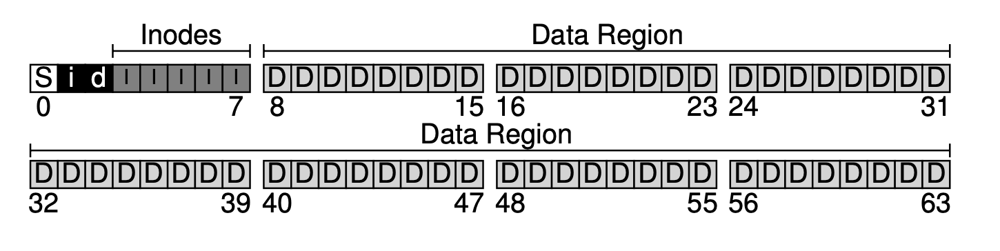
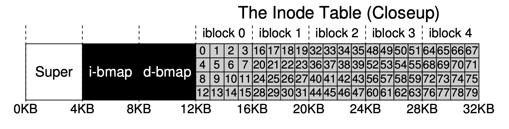
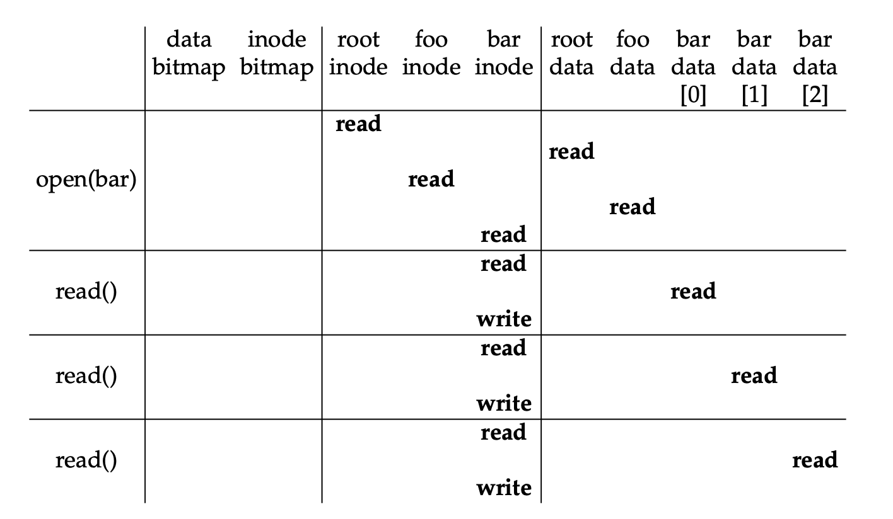
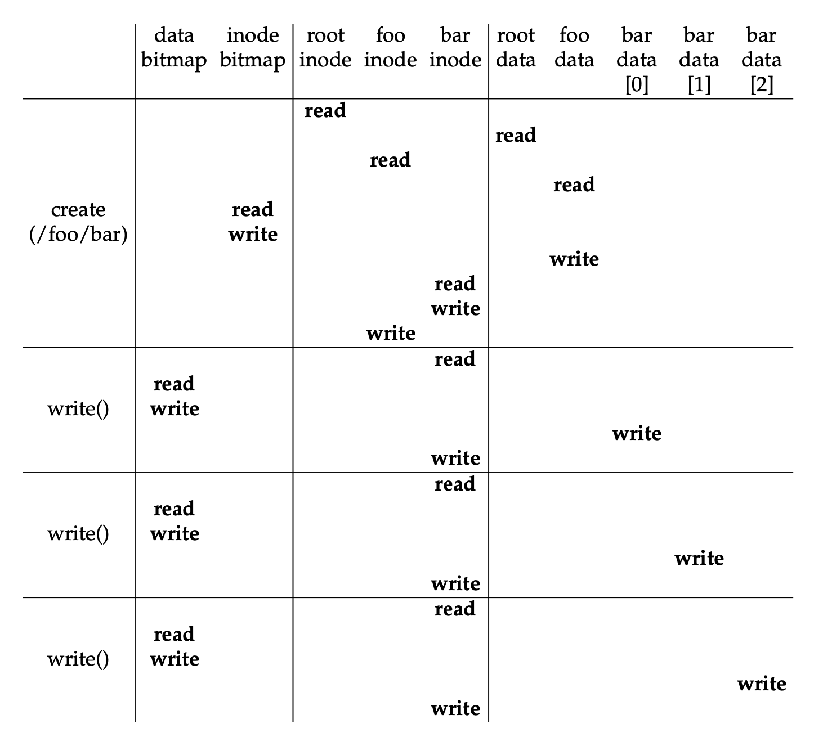

# Chapter 40

## Two Aspects of File Systems

1. Data Structures

   1. data
   2. metadata (inodes map, data blocks map)

2. Access Methods (how does it map calls like `open` and `read` by a process)

## Disk Organization

- First, we divide the disk into **blocks**
- Second, we allocate a huge region of blocks for user data
- Then, we allocate metadata (**inodes**) like which blocks comprise a file, the size of the file, its permissions, etc.
- Next, we allocate structures to track with blocks are free or allocated
  - the structure could be a lists of pointers pointing to free blocks
  - or it could be other structures like bitmaps for both **data region** or **inode table**
- Last, we will allocate a block for metadata about this file system like how many inodes, data blocks, etc.

</img>

## File Organization (Inode)

- An inode has information like direct pointers, indirect pointers to point to data blocks
- Given an inode number, we get the address (block number) of the desired block with inode region start address
- Then, we calculate the sector number to tell the disk which sector to read
- Calculation

```
blk = (inumber * sizeof(inode_t)) / blockSize;
sector = ((blk * blockSize) + inodeStartAddr) / sectorSize;
```

### Example

- Block size of 4KB, inode size 256 bytes, a sector of 512 bytes, inode start address of 12KB
- We want to read inode number 32
- Block number is (32 \* 256) / 4096 = 2
- Sector number is (2 \* 4KB + 12KB) / 512 = 40

</img>

## Multi-Level Inode Pointers

- The idea is to have indirect pointers
- Instead of pointing to a block that contains user data, it points to a block that contains more pointers
- For example,

  - with 12 direct pointers and 1 indirect pointer
  - block size of 4KB and an address size of 4 bytes
  - we can have up to (12 + 4K / 4) = (12 + 1K) blocks

- With double or even triple indirect pointers, the size of a file could be grows exponentially
- For example,

  - with 12 director pointers, 1 indirect pointer, and 1 double indirect pointer
  - we can have file with size up to (12 + 1K + 1K \* 1K) blocks

## Directory Organization

- A directory basically a block that contains a list of pairs of (entry name, inode number)
- We can store more informations like _record length_ and **string length** in the pair
- File systems treat directories as a special type of files (in inode, the type file of a directory will be d)

## Free Space Management

- The file system should keep track free and allocated space so it knows what space to use when new file is created
- In our example, we just use two bitmaps to keep track of free and allocated space for inode and data regions
- But in other systems, they might use different algorithms to find free space in different ways

## Access Paths

### Open & Read

- Open
  - first traverse to the working directory (`/foo`) by reading inode and data of each directory
  - then read the inode of the target file and get its info for the system open file table
- Read
  - first read the inode to get the pointers to the data blocks
  - then read the blocks we want to read from
  - last write the inode to update the offest, last accessed timestamp, etc.

</img>

### Create & Write

- Create
  - first traverse to the target directory (`/foo`) by reading inode and data of each directory
  - then get the empty inode and mark it as allocated in the bitmap
  - next update the target directory list of pairs with the new inode
  - then initialize the target file and write information like create timestamp
  - last update the directory inode
- Write
  - first read the inode to get the pointers to the data block
  - then read and write the to get the empty data blocks and mark them as allocated in the bitmap
  - next write the blocks we want to write to
  - last write the inode to update the offset, last modified timestamp, etc.

</img>

## Caching

- To improve performance, most file systesm will use system memory to cache popular blocks
- static partitioning
  - using a fixed-size cache to hold popular blocks
  - using algorithm like LRU or other variants to decide which blocks to cache
  - unused pages could be a waste
- dynamic partitioning
  - integrate virtual memory pages and file system pages into a **unified page cache**

## Buffering

- Caching is good for reading but not effective on writing
- Buffering by delaying writes has a few benefits:
  1.  the file system can batch some updates into a smaller set of I/O requests
  2.  the file system can schedule the subsequent I/O requests
  3.  some writes can even be avoided (e.g. a file is created and deleted soon after creation)
- tradoffs: if the system crashes before updates being updated to disk, the updates are lost

## Keywords

1. blocks: the smallest unit to read and write on disk
2. inodes (index nodes): the structure to store metadata about files
3. record length: the number of bytes of name and leftover space
4. string length: the number of bytes of name
