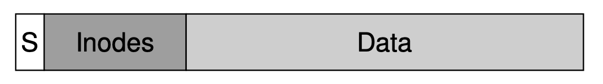
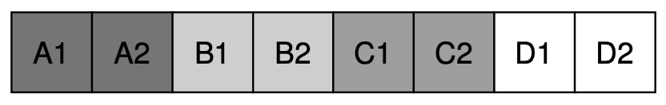
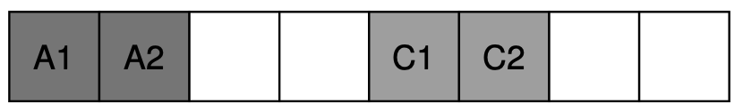
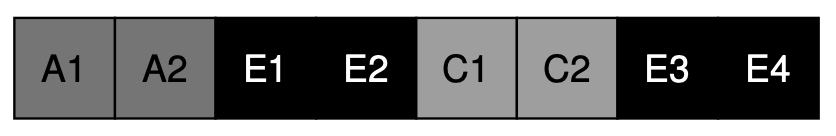
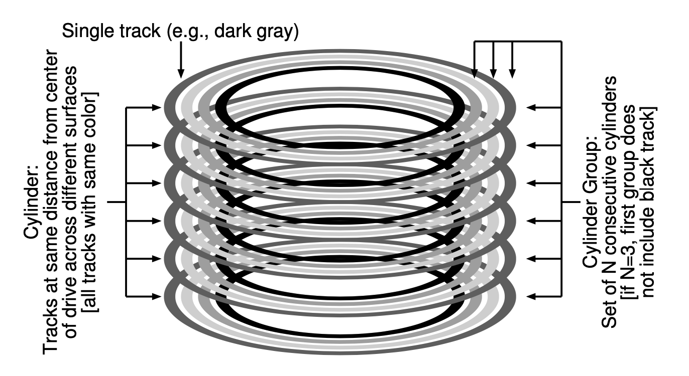
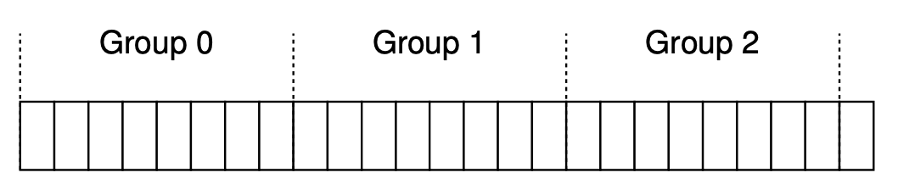
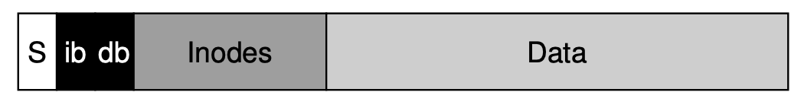
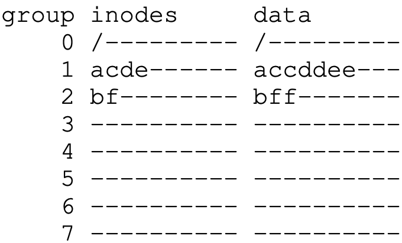
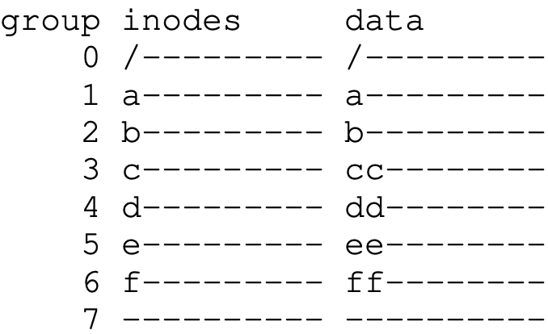
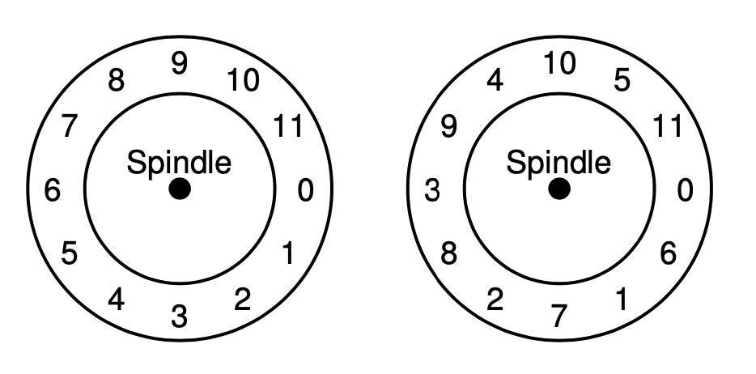

# Chapter 41

## Old UNIX File System

- Simple, support basic abstractions
- Poor performance, expensive seek because of unawareness of disk
  - the OS treats the disk like the memory
- the file system end up getting **fragmented** as the free space is not carefully managed
  - this is what disk defragmentation tool is for
- If blocks were too small, it is
  - **good** for **minimizing internal fragmentation** but
  - **bad** for **transferring** that might need **overhead positioning**
- Layout

  </img>

- An example to demonstrate the problem

  </img>

  </img>

  </img>

## Fast File System (FFS)

- A file system creates the tradition to keep the same interface to the file system (`open`, `read`, `write`, `close`, etc.)
- New file systems follow the same interface but use different implementations

### Disk Organization

- We split disks into N consecutive cylinder groups
- A single cylinder group is comprised of a set of cylinders
- A clyinder is a set of tracks on different surfaces
- Cylinder structure

  </img>

### File System Point of View

- With different structures, disk still export the same logical address space of blocks and hide details of their geometry (structure)
- File systems then organize the drive into block groups
- Illustration of disk divided into block groups

  </img>

### FFS Organization

- FFS specifically makes sure to place these things into the same group
  - data in a single file
  - files within the same directory
- FFS also keeps a copy of the super block in each group to enhace reliability
- Within each group, it has
  - a **per-group inode bitmap & data bitmap**
  - a **per-group indoe & data blocks regions**
- Depiction of a FFS cylinder group

  </img>

## Policies Comparison

- FFS Policies
- Another policy that spreads inodes across groups (ensure no group filled up fast)
- An example of three directories (`/`, `/a`, `/b`) and four files (`/a/c`, `/a/d`, `/a/e`, `/b/f`)
- Illustrations (FFS vs. the other)

  </img>
  </img>

## Large-File Exception

- When a large file comes in, the simple FFS policy described above won't work too well
- Because the large file occupies most of the group and other subsequent file can't stay in the group
- Thus, the FS will spread the rest of the data to another group after a number of blocks are allocated
- We also need to choose chunk size carefully because spreading the file too much will hurt performance
- For example,
  - the average position time is 10 ms, the disk transfer rate is 40 MB/s
  - we want to achieve 50% peak disk performance (i.e. 10ms in positioning and 10ms in actual transferring)
  - The chunk size should be $40MB/s * 0.01s = 409.6KB$
- FFS Approach:
  - It places the direct blocks in the same group but all indirect blocks in differet groups

## Other Innovations from FFS

- When blocks are too big (e.g. 4KB for most files being 2KB or so), internal fragmentation becomes a problem

  - Thus, FFS designers introduce **sub-blocks** (e.g. 512 sub-blocks)
  - FFS will first allocate sub-blocks until the file grows to 4KB
  - Then it will copy the sub-blocks into a 4KB block
  - Moreover, the `libc` library buffers writes and then issues 4KB chunks to the file system to prevent overhead

- The second problem is during sequential reads, after reading block #1, the disk might rotate to block #3

  - Thus, FFS designers propose a disk layout with **parameterization**
  - The system will then layout the disk based on the parameter
  - For example, for a system that reads longer than a a block rotation (right)

    </img>

## Keywords

- distance metric: how far up the directory tree to find the common ancestor of two files (for analyzing how far two files are from each other)
