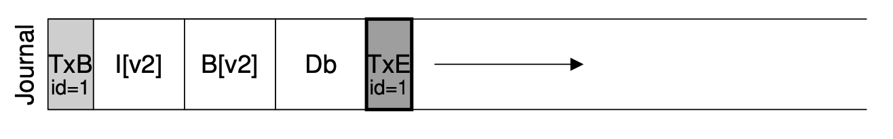
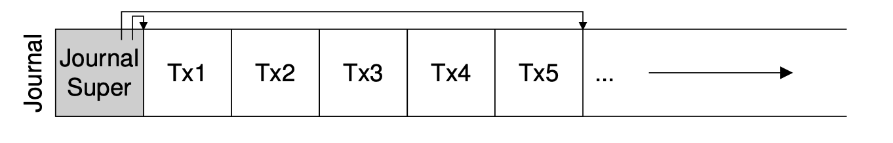
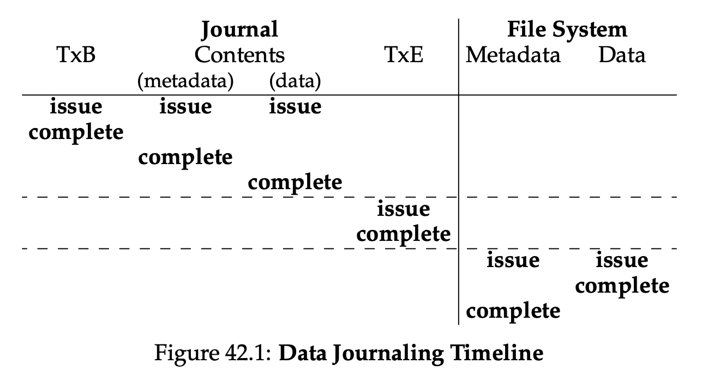
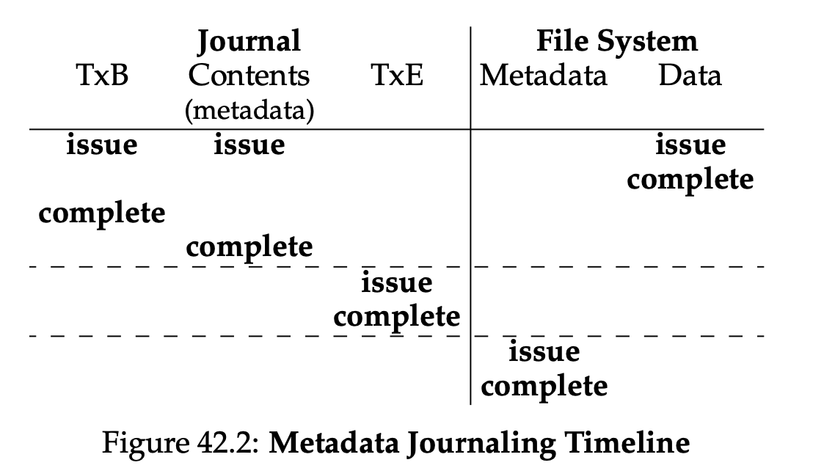

# Chapter 42

## Crash-Consistency Problem

- The problem happens when we issue two writes, one to the bitmap and its corresponding block,
- the power goes down in the middle of the writes
- The file system is now left at a inconsistent state
- There are two major approachs
  1.  fsck: file system checker
  2.  journaling: write-ahead logging

## Example

- One file (one inode block & one data block)
- We want to append to the file (new data block)
- We have three writes
  1.  inode block (new pointer to a new block)
  2.  data bitmap (new block should be marked as allocated)
  3.  data block (new block allocated for the data)

### Notes

- The writes will first sit in the memory (**buffer cache** / **page cache**)
- After some time (e.g. 5 secs, 30 secs), the file system will issue the writes to the disk

## Crash Scenarios

1. Only data block is written
   - This is _fine_ from the perspective of consistency in file system
2. Only inode block is written
   - we could read the garbage data (old content)
   - or we could read the data for other file (if the data block is then allocated to other file because bitmap is not updated)
   - **file system inconsistency**
3. Only bitmap is written
   - we couldn't use data block anymore
   - **space leak**
   - **file system inconsistency**
4. Only data block is NOT written
   - point to garbage data
5. Only inode block is NOT written
   - The data block is wasted because the bitmap marks it as used
   - **file system inconsistency**
6. Only bitmap is NOT written
   - The blocks can be overwritten because the bitmap marks it as unused
   - **file system inconsistency**

## Solution #1: File System Checker

- The main idea is to let inconsistencies happen and then fix them later
- The checker will scan the file system at the boot time
- The disadvantage is the scanning is too **slow**
- Summary
  - Superblocks
    - replace corrupt ones with other copies
  - Free blocks
    - It scan the blocks with pointers (inodes, indirect blocks, etc.)
    - in order to produce a correct version of the data bitmap
    - It does the same thing to make sure all used inodes are marked used in the inode bitmap
  - Inode states
    - it checks if each inode is corrupted (e.g. types like file, directory, symbolic links)
    - if an inode is considered corrupted, it just clears the inode
  - Inode links
    - it verifies the link count of each allocated inode
    - for those inodes with a link count of 0, it moves them to the `lost+found` directory
  - Duplicates
    - it checks if two different pointers point to the same block
    - it either clears them or creates a copy for each duplicate
  - Bad blocks
    - it checks if all pointers in the block are valid or not
  - Directory blocks
    - it performs integrity check on the content of the directory

## Solution #2: Journaling (Write-Ahead Logging)

- the general idea is to write notes about the subsequent requests (**write ahead**)
- and the structure on the disk that we write to is theh **log**
- if a crash happens, we can recover by referring to the notes and reperform the requests

### Data Journaling

- With the same example, above, we have three writes for one task (append to a file)

- We will write five blocks here,

  - `transaction-begin` (`TxB`): the block marks the beginning of the transaction
  - the middle blocks are the exact content we will write to the final locations on the disc
  - `transaction-end` (`TxE`): the block marks the end of the transaction
    

- Summary

  - Journal write
    - write the `TxB` and the content blocks to the log
  - Journal commit
    - write the `TxE` to the log
    - need this to check if the transaction is written safely
    - mering everything including `TxE` is unsafe
    - the size of `TxE` is smaller than a limit that the disk guarantees atomicity
  - Checkpoint
    - once the transaction is on disk safely, we update the content to final locations on disk
  - Free
    - mark the transaction free after checkpointing
    - using two pointers to mark oldest and latest uncheckpointed transactions
      

- Disadvantages

  - Writing the same data blocks at least **twice**

- Batching

  - for example, create two files in the same directory
  - we can merge two separate changes to the directory inode to a single one
  - and buffer two transactions to a larger one

- Crash Senarios

  1.  Before transaction is safely written: the entire transaction is skipped
  2.  After transaction is safely written and before the checkpoint is safely written:
      - scan the log and re-checkpoint the transaction

  

### Metadata Journaling

- The main difference is to not write user data to the log but to the final locations instead
- We should **always first** write the data before the pointer to prevent pointing to garbage
- Summary

  - Data write
    - write the data to the final location
  - Journal metadata write
    - write `TxB` and the metadata to the log and **wait**
  - Journal commit
    - write `TxE` to complete writing the transaction
  - Checkpoint metadata
    - write the content of the transaction to the final locations on disk
  - Free
    - mark the transaction free to free up spaces for future transaction

  

#### Potential Problem

- We have a directory called `foo/` and we have its metadata on the log
- The content of the directory is on the log too because **the content of a directory is considered metadata**
- Then the user deletes it and create a new file `bar` that happen to be using the same inode
- A crash happens and the system starts the recovery after reboot
- The content of `bar` is overwritten with the metadata (content of `foo/`)
- Potentail solutions
  1.  never reuse blocks until said blocks are checkpointed
  2.  add **revoke records** and scan them before replaying the log to prevent the issue

## Other Solutions

- Soft updates
  - carefully order all writes
  - hard to implement
- **copy-on-write** (COW)
  - never overwrites files or directories in place
  - places new updates to previously unused locations on disk
  - used in log-structured file systems (LFS)
- Backpointer-based consistency
  - an additional back pointer in every block
  - to have a reference to the inode it belongs
- Optimistic crash consistency
  - better performance
  - requires slightly different disk interfaces
